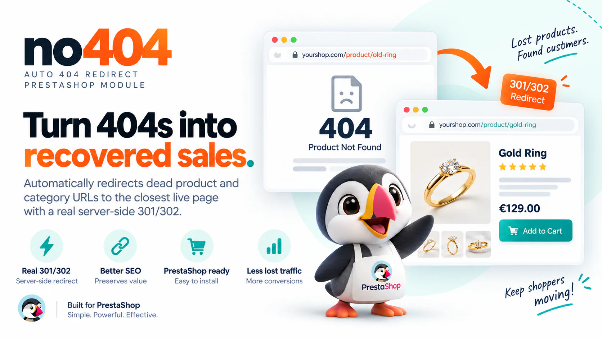
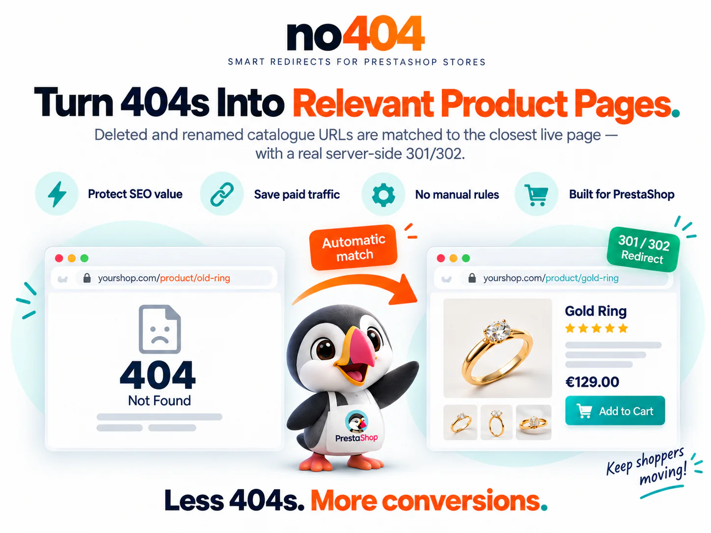
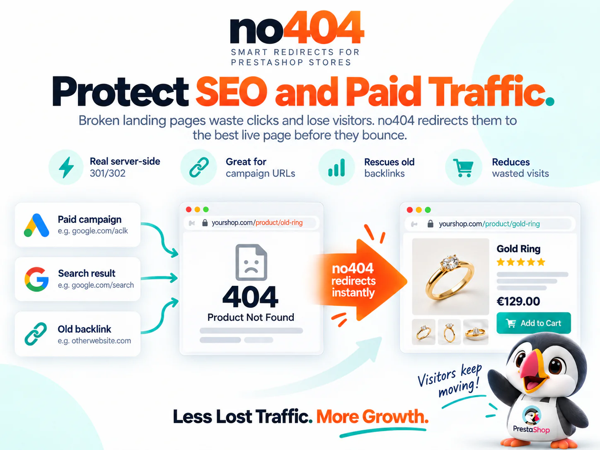
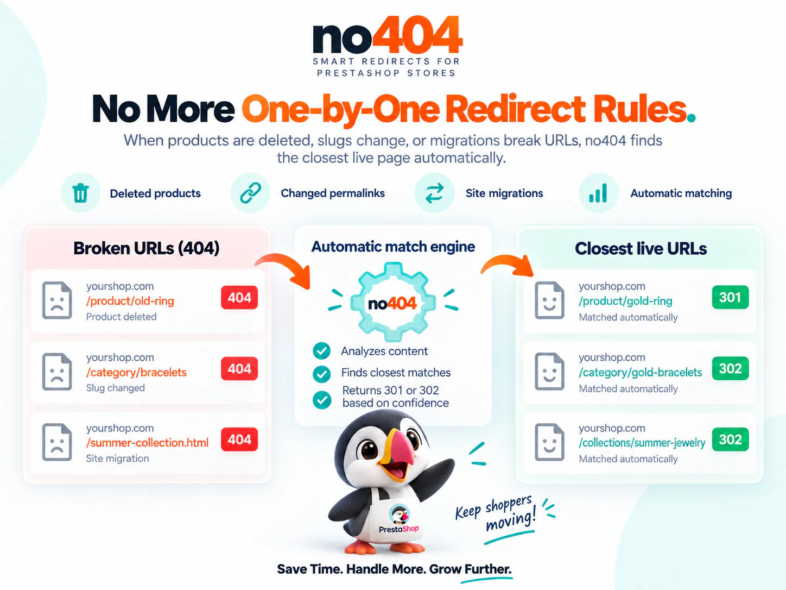
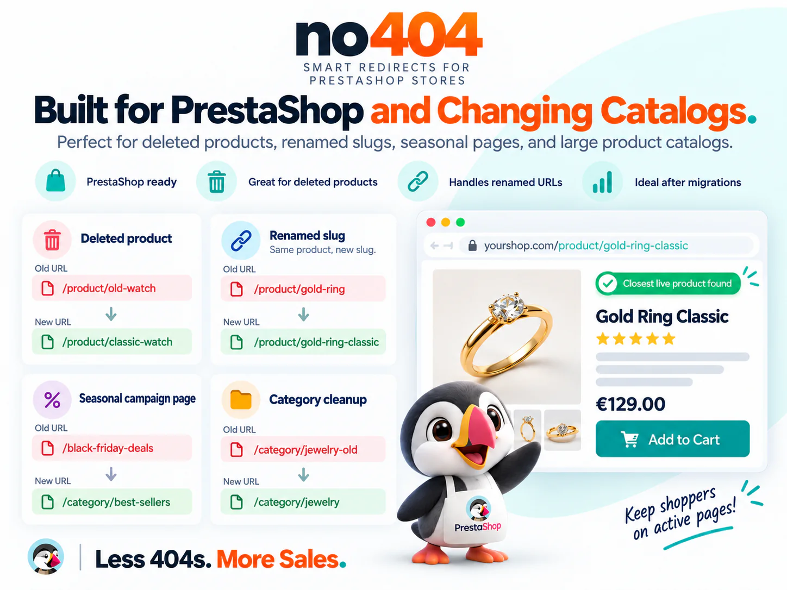
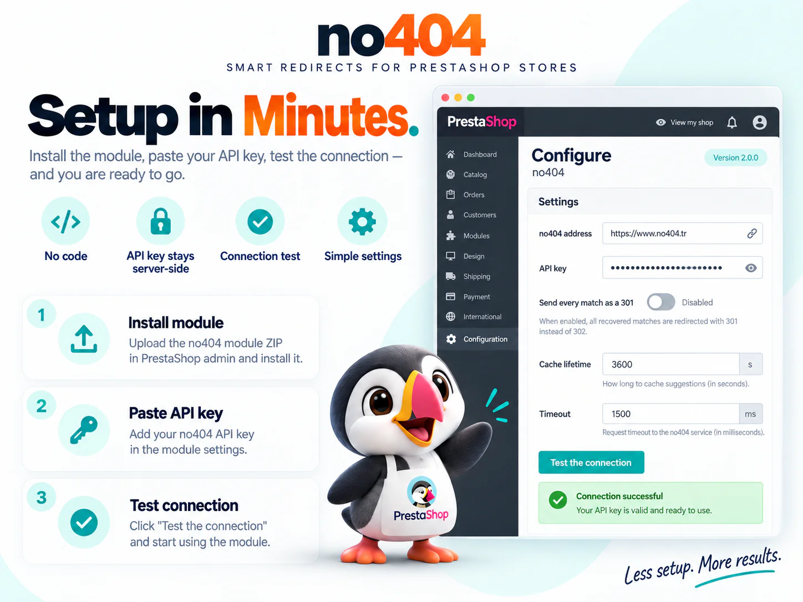

# no404 – Auto 404 Redirect for PrestaShop

<p align="center">
  
</p>

> **Status: ready to use.** Two lines of the same module: **2.1.0** for PrestaShop 9 and
> **1.1.0** for PrestaShop 8 — both ready-made zips are in [`dist/`](dist/). Not on the
> PrestaShop Addons marketplace yet (see [Installation](#installation)); anything marked
> *planned* is not available today.

Turns the dead URLs of your PrestaShop store — deleted products, removed categories,
renamed pages — into real, server-side **301/302 redirects** to the closest live URL in
your current catalogue, using the [no404](https://www.no404.tr) service.

---

## What no404 is

no404 is a hosted service that watches the 404 traffic of a website and finds, for each
dead address, the closest valid URL in the site's **current** catalogue. The catalogue is
built from the sitemap you submit through Google Search Console; matching is fuzzy and
tolerant of renames, so `/old-red-sneaker-42` still finds `/red-sneakers-42`.

You connect Google Search Console, pick a verified property, and get an API key. Any
integration — the JavaScript snippet, the WordPress plugin, or this module — sends the
dead path to `https://www.no404.tr/api/v1/resolve` and gets back the best target.

## What this module does for a PrestaShop merchant

<p align="center">
  
</p>

- **A real 301, server side.** The JavaScript snippet documented at no404.tr works on any
  platform but leaves the HTTP status at 404: Google still sees a dead page, no link
  equity is passed, and bots that do not run JavaScript are never redirected. This module
  redirects **before any HTML is sent**, so search engines and visitors both land on the
  right page.
- **No rules to write.** A deleted product URL finds its closest surviving equivalent on
  its own. You do not maintain a redirect table.
- **Respects your no404 dashboard settings.** Whether a match is sent as a permanent
  (301) or temporary (302) redirect is decided by the 301 threshold you choose per site
  in the no404 dashboard; the API returns `redirectStatus` and the module obeys it. The
  threshold is never hard-coded in the module.
- **Manual redirects win.** A redirect you define by hand in the no404 dashboard always
  takes priority over automatic matches and is always a 301.
- **No soft 404s.** When nothing in the catalogue is close enough, the module does
  **nothing** and PrestaShop renders your theme's own 404 page. It never sends visitors
  to the homepage "just in case" — Google treats that as a soft 404 and the visitor does
  not find what they were looking for. (If you enable "parent category" fallback in the
  no404 dashboard, that is honoured too; the service never falls back for addresses that
  have no similarity to your catalogue at all, such as bot probes.)
- **Defers to PrestaShop.** If a product or category has its own PrestaShop redirect
  setting (301/302 to another product or category), PrestaShop handles it first and this
  module is never involved.

<p align="center">
  
</p>

## How it works

```
Visitor requests /old-product
        │
        ▼
PrestaShop decides the request is a 404
(page not found, deleted product, deleted category)
        │
        ▼
hook actionNotFound             PrestaShop 9.1.5 and newer; fires only on 404s
  or actionOutputHTMLBefore     PrestaShop 8 and 9.0 – 9.1.4, which have no
                                "page not found" event: acts only when the
                                response is already a 404
        │
        ├─ Not a GET/HEAD request?              ──► do nothing
        ├─ Static file or admin/module path?    ──► do nothing
        ├─ Path excluded in settings?           ──► do nothing
        ├─ Already in the local cache?          ──► use the cached answer
        ├─ Service recently failed / rate-limited? ──► do nothing (circuit breaker)
        │
        ▼
Ask no404: GET /api/v1/resolve?path=/old-product&ref=<referer>
           Authorization: Bearer <your API key>   (1.5 s timeout, all failures swallowed)
        │
        ▼
Validate the target: same store host, no loop, no control characters
        │
        ▼
Location: <target>  with 301 or 302 (from redirectStatus)  +  X-Redirect-By: no404
```

If anything goes wrong at any step — the service is slow, down, or returns something
unexpected — the module does nothing and PrestaShop renders your own 404 page as usual.

<p align="center">
  
</p>

### Which 404s are covered

| Situation | Handled |
| --- | --- |
| URL that matches no route (typo, old URL structure, migrated site) | Yes |
| Deleted product (`id_product` no longer exists) | Yes |
| Deleted category | Yes |
| Product or category that still exists but is **disabled** and set to "404 Not Found" in PrestaShop | With **Catch-all mode** switched on (off by default). PrestaShop renders this 404 without its "page not found" event; the catch-all mode looks at responses that are already 404s right before they are sent. On PrestaShop 8 and 9.0 – 9.1.4 this path is always on — the core has no "page not found" event there at all — and the switch is not shown. |
| Product or category that is disabled and set to redirect (301/302) in PrestaShop | Not needed — PrestaShop redirects it itself. |
| CMS page removed from the shop | **Partially** — PrestaShop redirects to its 404 page first, so the original path is lost. |
| Missing static file (`/img/…`, `/css/…`) | Deliberately ignored — it has no catalogue counterpart and would only use quota. |

<p align="center">
  
</p>

### Friendly URLs must be on

The module works with PrestaShop's SEO-friendly URLs (`/en/red-sneakers-42`). With
friendly URLs disabled, PrestaShop addresses look like `index.php?id_product=42&controller=product`;
the module strips query strings and ignores `.php` paths by design, so it does nothing in
that mode and shows a warning on its settings page.

## Requirements

| | |
| --- | --- |
| PrestaShop | **9.0.0 or newer** → the 2.x line, `no404-2.x.y-ps9.zip` (developed and tested against 9.1.x — 9.1.5 at the time of writing). **8.0 – 8.2** → the 1.x line, `no404-1.x.y-ps8.zip`. Same module, same settings; see FAQ. |
| PHP | 2.x: 8.1 or newer (8.5 recommended, as for PrestaShop 9.1). 1.x: 7.2 or newer (8.1 recommended, as for PrestaShop 8). The `curl` extension is required. |
| no404 account | A site added through Google Search Console, and its API key (Dashboard → your site → Integration). |
| Store URLs | SEO-friendly URLs enabled. |

## Installation

Channels, in order of preference:

1. **PrestaShop Addons marketplace** (planned) — install from *Modules → Module Manager*.
   Modules installed from Addons receive update notifications and one-click upgrades.
2. **The ready-made zips in [`dist/`](dist/)** —
   `-ps9` for PrestaShop 9, `-ps8` for PrestaShop 8 —
   *Modules → Module Manager → Upload a module*. Do not unpack it. Manually uploaded
   modules do **not** auto-update; you will have to re-upload new versions yourself,
   including security fixes. Your settings are kept when you do.
3. **Source code** — for review and contributions, not an installation path: a clone
   has no production autoloader. Build the zips with `composer install && php bin/build.php`
   (`--target=ps9` or `--target=ps8` for one of them).

After installing:

1. Create an account at https://www.no404.tr and add your store through Google Search Console.
2. Open the store in the no404 dashboard, go to **Integration**, and copy the API key.
3. In PrestaShop, open **Modules → Module Manager → no404 → Configure**, paste the key
   and save.
4. Click **Test the connection**. The result tells you precisely what is wrong if
   anything is: an invalid key, an inactive subscription, and an exhausted quota each
   produce their own message rather than a generic failure.

The API key is the only value you need to enter. The service address field is already
filled in correctly.

<p align="center">
  
</p>
<p align="center"><sub>Illustration of the settings page. The real page has a few more options — see <a href="#configuration">Configuration</a> for every field and its default.</sub></p>

## Configuration

| Setting | Default | What it does |
| --- | --- | --- |
| Apply no404 redirects | On | The master switch. |
| no404 address | `https://www.no404.tr` | Only change this if you host no404 yourself. Leave empty to restore the default. |
| API key | — | Stored server-side; shown masked after saving. Submitting the field empty keeps the current key. |
| Send every match as a 301 | Off | Turns temporary (302) redirects into permanent (301) ones. A 301 is cached permanently by browsers and cannot be taken back — enable only if you are confident in your catalogue. |
| Cache lifetime | 3600 s | Min 60, max 604800 (7 days). Shorter means more quota used. |
| Timeout | 1500 ms | Upper bound 1500. After this the request is dropped and your 404 page is shown. |
| Excluded paths | — | One path prefix per line; never sent to the service. |
| Catch-all mode | Off | Also handles 404 pages PrestaShop renders without its "page not found" event (see *Which 404s are covered*). Runs only on responses that are already 404s. Shown on PrestaShop 9.1.5 and newer only: on PrestaShop 8 and 9.0 – 9.1.4 this path is always on, because the core has no "page not found" event there. |
| Cache backend | Files | *Files* works everywhere. *APCu, then files* answers from shared memory first — useful on busy stores; falls back to files when APCu is missing. |
| Cache directory | — | Empty = PrestaShop's cache directory. Set an absolute path only if that one is not writable. The module only ever writes to (and on uninstall deletes) its own `no404/` sub-folder there. |
| Debug headers | Off | Adds `X-No404-*` headers to responses to help support diagnose a setup. Never contains the key or visitor data. |

**Multistore.** Every setting can be set for all shops, a shop group, or a single shop
using PrestaShop's standard multistore checkboxes, so each store can carry its own API
key. Caches and the circuit breaker are kept per shop: a quota exhausted on one store does
not silence the others.

## What data is sent — and what is not

Every lookup is a single HTTPS request from your server to the no404 service.

**Sent**

- The path that returned 404, for example `/old-product`. Query strings and fragments are
  stripped before sending, so `?utm_source=…` parameters never leave your server.
- The referring URL from the HTTP `Referer` header, when the browser supplies one.
- Your store's URL and the module version, in the `User-Agent` header, to identify the
  installation.
- Your API key, in the `Authorization` header (not in the URL, so it does not end up in
  web-server or proxy logs).
- When the dead URL was reached from an ad click, the ad network's **category** only —
  `google`, `microsoft`, `meta` or `other` — worked out locally from the click-ID or
  `utm_medium`/`utm_source` parameters. The click IDs themselves (`gclid`, `msclkid`, …) and
  the rest of the query string never leave your server.
- When the visitor arrived from an AI assistant (ChatGPT, Claude, Perplexity, Gemini,
  Copilot…), the assistant's **category** only — `chatgpt`, `claude`, `perplexity`,
  `gemini`, `copilot`, `meta` or `other` — worked out locally from a known `utm_source`
  value (for example `utm_source=chatgpt.com`) or from the referrer's host. The
  `utm_source` value and the rest of the query string never leave your server.
- The visitor's IP address **truncated to its network**: the last part of an IPv4 address is
  set to zero (`203.0.113.45` becomes `203.0.113.0`), and only the first 48 bits of an IPv6
  address are kept. Private and local addresses are not sent. Behind Cloudflare or a reverse
  proxy the address is read from `CF-Connecting-IP`, `X-Forwarded-For` or `X-Real-IP`.
- A **pseudonymous visitor ID**: a keyed hash (HMAC-SHA256) of the visitor's IP address,
  computed on your server with a secret derived from your store's own cookie key. no404
  never receives the secret, so it cannot turn the ID back into an address or recognise the
  same visitor on another store. It only lets your dashboard count unique visitors.
- The visitor's browser **user agent** (for example `Mozilla/5.0 (iPhone; …)`), used to tell
  bots from people and to group requests by device.
- The visitor's **country code**, only when your store is behind Cloudflare and it supplies
  one (`CF-IPCountry`).

The visitor data travels in separate `X-No404-Visitor-*` request headers. Without them
every 404 in the no404 dashboard would show your server's own address and the module's
user agent, because the lookup is made from your server.

**Not sent**

The module does not transmit the visitor's full IP address, cookies, session data, cart
contents, form contents, or any other personal data.

**Changing or removing the visitor data.** Before each lookup the module runs the
`actionNo404Visitor` hook with `['visitor' => &$visitor]` (`ip`, `user_agent`, `country`).
A module of your own can change those values — for example to read the IP from a proxy
header this module does not know — or set `$params['visitor'] = []` to send none.

Query strings are not sent because tracking parameters would fragment the local cache and
multiply quota usage. The ad and AI categories above are enough for the "ad traffic" and
"AI traffic" breakdowns in the no404 dashboard; a 404 reached from an ad or from an AI
assistant is always looked up (not answered from the cache) so that every such visit is
counted.

**Service provider:** no404 — https://www.no404.tr · Terms: https://www.no404.tr/en/terms ·
Privacy: https://www.no404.tr/en/privacy

## Your store never waits (fail-open guarantee)

- The lookup has a **1.5 second timeout** and every failure — DNS, TLS, timeout, HTTP
  error, malformed JSON — is swallowed. On failure the module returns "no redirect" and
  your theme's 404 page renders normally.
- A **circuit breaker** stops further lookups for 60 seconds after a transport error or a
  5xx, and for 300 seconds after a 429 (quota) or a 403/404 (configuration). An outage on
  the no404 side never adds a timeout cost to every 404 your store serves.
- The module only runs on requests that are already 404s. Normal product, category and
  checkout pages are never touched and never slowed down.
- If the cache directory is not writable, the module keeps working without a cache and
  shows a warning on its settings page (your quota is then unprotected — fix the
  permissions).

## Caching and quota

Your no404 plan is limited by the number of 404 events per month. The module protects that
quota with a local cache, one entry per path, **including negative results**: a bot
requesting the same dead URL 200 times a day costs you one event, not 200. Cached paths,
static files, admin/module paths, non-GET requests and requests made while the circuit
breaker is open are never sent.

The cache lives under PrestaShop's `var/cache` directory (or the directory you set). Clearing
the PrestaShop cache from the back office also clears it; the only effect is a cold start.
Saving the module settings clears it too, so a corrected API key takes effect immediately.

On a store served by several web servers, each server keeps its own file cache; that only
costs quota, never correctness. APCu (if selected) is per server as well.

## FAQ

**Does every 404 use up part of my quota?**
No. See *Caching and quota* above.

**What happens if the no404 service goes down?**
Nothing visible. The lookup fails silently, your own 404 page is shown, and the circuit
breaker stops further attempts for a while.

**It redirected someone to the wrong page. How do I fix that?**
Add a manual rule in your no404 dashboard. Manual rules always win over automatic matches
and always produce a 301. You can also raise the match threshold or the 301 threshold for
the site in the dashboard; the module follows those settings without any change on the
PrestaShop side.

**How can I tell a redirect came from this module?**
Every redirect carries an `X-Redirect-By: no404` header. Enable *Debug headers* in the
settings to also see the match source and score.

**Does it slow down my store?**
Normal pages are untouched. On a 404 the worst case is 1.5 s once, after which the circuit
breaker and the cache take over.

**Can a redirect send visitors to another website?**
No. Targets are only accepted if they point to one of your store's own domains (including
alternate domains configured in PrestaShop). Anything else is discarded.

**I use a language prefix (`/en/…`, `/fr/…`).**
Supported. The path is sent with its prefix, and because your sitemap contains the
localised URLs, matches come back localised too.

**PrestaShop 8?**
Supported by the 1.x line: upload `no404-1.x.y-ps8.zip` (PrestaShop 8.0 – 8.2, PHP 7.2+).
It is the same module with the same settings. PrestaShop 8 has no "page not found"
event, so every 404 is caught right before the page is sent — what the catch-all mode
does on PrestaShop 9. When you upgrade your store to PrestaShop 9, upload the `-ps9`
zip: it installs as a module upgrade (2.x) and keeps your settings.

**Where is the WordPress version?**
https://wordpress.org/plugins/no404-auto-404-redirect/ — same behaviour, same rules.

## Support

- Documentation: https://www.no404.tr/en/docs
- Contact: https://www.no404.tr/en/contact
- Issues for this module: https://github.com/RoPi-LLC/no404-prestashop/issues

## License

Licensed under the **Academic Free License 3.0 (AFL-3.0)** — see [`LICENSE`](LICENSE). It
is the license used by PrestaShop's own modules and one of the licenses accepted by the
Addons marketplace.

Note that the no404 WordPress plugin is distributed under GPL-2.0-or-later, as required by
WordPress.org. The shared core client is written and owned by no404 and is released under
each platform's expected license; the two distributions are therefore licensed
differently on purpose.
